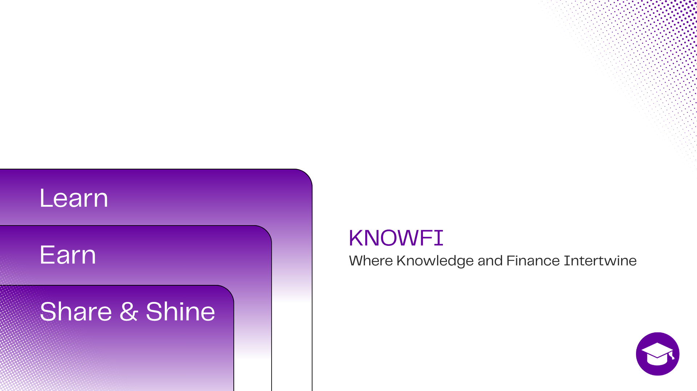

# KnowFi: Where Knowledge and Finance InterKnowFi: Where Knowledge and Finance Intertwine.

KnowFi is here today—and we're already building tomorrow.

A world where learning is rewarding, knowledge is currency, and every achievement opens a new do### 🌟 The Future – What's Coming Next

- **📣 FiShare + KnowAI – Share Smarter:** Share your achievements instantly to social media, with KnowAI crafting eye-catching captions tailored for you.
- **🗺️ KnowFi Adventure:** Dive into an epic gamified experience where you earn more Knowkens through quests and challenges powered by KnowCreates content.
- **💎 KnowFi Marketplace:** Buy, sell, and trade NFTs earned from completing KnowCourses, KnowQuizzes, and KnowFi Adventures—turning learning into a true digital asset economy.powering the next generation of Web3 learners and builders.

## 🏗️ Architecture Overview

KnowFi is built using a modern, scalable architecture on the Internet Computer:

### 🔧 Backend Canisters (Motoko)

- **`auth`** - Authentication and authorization management
- **`profile`** - User profile management and social features
- **`courses`** - Course creation, approval, and content delivery
- **`quiz`** - Quiz system with gamification and token rewards
- **`quests`** - Daily quests and challenge management
- **`forum`** - Community discussions and social interactions
- **`icrc7`** - NFT minting and marketplace functionality

### 🎨 Frontend (Next.js 14)

- **Modern React** with TypeScript
- **Tailwind CSS** for responsive styling
- **Radix UI** components for accessibility
- **Monaco Editor** for integrated code editor
- **Internet Identity** integration for Web3 authentication

### 🛠️ Key Technologies

- **Internet Computer Protocol (ICP)** - Decentralized hosting and smart contracts
- **Motoko** - Backend smart contract development
- **Internet Identity** - Decentralized authentication
- **ICRC-7** - NFT standard for certificates and achievements
- **Next.js 14** - Modern React framework
- **TypeScript** - Type-safe development
- **Tailwind CSS** - Utility-first styling

## ✨ Key Features

### 📚 **Interactive Learning Platform**

- **Comprehensive Courses**: From blockchain basics to advanced Motoko programming
- **Hands-on Labs**: Integrated code editor for practical learning
- **Video Content**: High-quality educational videos and tutorials
- **Progress Tracking**: Monitor your learning journey and achievements

### 🎮 **Gamification & Rewards**

- **Knowkens Token System**: Earn tokens for completing activities
- **Daily Quests**: Regular challenges to maintain engagement
- **Achievement NFTs**: Collect certificates and badges as NFTs
- **Leaderboards**: Compete with other learners
- **Energy System**: Manage your learning sessions strategically

### 👥 **Community Features**

- **User Profiles**: Showcase your learning achievements
- **Social Integration**: Connect your social media accounts
- **Forum Discussions**: Engage with the KnowFi community
- **Course Reviews**: Rate and review educational content

### 🏫 **Creator Economy**

- **Course Creation**: Educators can submit new courses
- **Content Approval**: Quality-controlled course approval system
- **Revenue Sharing**: Creators earn tokens from successful courses
- **Community Contributions**: Collaborative content development

### 🔒 **Web3 Integration**

- **Decentralized Authentication**: Internet Identity integration
- **On-chain Certificates**: NFT-based course completion certificates
- **Token Economy**: Transparent, blockchain-based reward system
- **Decentralized Storage**: Course content stored on ICP

## 🚀 Quick Start

### For Developers

```bash
# 1. Clone the repository
git clone https://github.com/crtzn/know_fi.git
cd know_fi

# 2. Install dependencies
yarn install

# 3. Start local Internet Computer replica
dfx start --clean --background

# 4. Deploy canisters
dfx deploy

# 5. Start frontend development server
cd src/know_fi_frontend
yarn dev

# 6. Open http://localhost:3000 in your browser
```

### For Users

1. Visit [KnowFi Platform](https://knowfi.app) (when deployed)
2. Connect with **Internet Identity**
3. Complete your **profile setup**
4. Start learning and earning **Knowkens**!

## 📚 Documentation

- **[🚀 Setup Guide](./docs/SETUP.md)** - Complete installation and development setup
- **[📖 API Documentation](./docs/API.md)** - Comprehensive API reference and integration guide
- **[🤝 Contributing Guidelines](./docs/CONTRIBUTING.md)** - How to contribute to KnowFi
- **[⚡ Commands Reference](./docs/COMMANDS.md)** - All development and deployment commands

## 🏆 Hackathon Submission

### ICP Hackathon 2025 Track: **Open Social & Community**

**Team:** KnowFi Team
**Built for:** Internet Computer Protocol (ICP) Hackathon 2025

### Key Innovation Points

1. **🎯 Educational Impact**: Democratizing Web3 education through gamification
2. **🔗 ICP Integration**: Full utilization of ICP's capabilities including:
   - Multiple interconnected canisters
   - Internet Identity authentication
   - ICRC-7 NFT standard implementation
   - Decentralized storage and computation
3. **🎮 Gamification**: Innovative token economy and reward system
4. **🌍 Community Building**: Social features and collaborative learning

### Technical Achievements

- **7 Production Canisters**: Auth, Profile, Courses, Quiz, Quests, Forum, NFT
- **Modern Frontend**: Next.js 14 with TypeScript and Tailwind CSS
- **Integrated Development Environment**: Monaco Editor for hands-on coding
- **Scalable Architecture**: Microservices pattern with inter-canister communication
- **Security First**: Role-based access control and input validation

### Demo Features

✅ **User Authentication** with Internet Identity
✅ **Profile Management** with social integration
✅ **Course System** with creator economy
✅ **Interactive Quizzes** with token rewards
✅ **Daily Quests** for sustained engagement
✅ **Community Forum** for discussions
✅ **NFT Certificates** for course completion
✅ **Gamified Learning** with leaderboards and achievements

### Future Roadmap

- **🌐 KnowRoom**: Social learning hub
- **✍️ KnowCreates**: Community-driven content creation
- **🎯 KnowFi Adventure**: Advanced gamification
- **💎 NFT Marketplace**: Certificate trading platform
- **🤖 KnowAI**: AI-powered learning assistance

**KnowFi: Where Knowledge and Finance Intertwine.**

**KnowFi is here today—and we're already building tomorrow.**

**Empowering the next generation of Web3 learners and builders.**

## 🛠️ Technology Stack

### Backend (Internet Computer)

- **Motoko** - Smart contract development
- **DFX** - DFINITY Canister SDK
- **Internet Identity** - Decentralized authentication
- **ICRC-7** - NFT standard

### Frontend

- **Next.js 14** - React framework
- **TypeScript** - Type-safe JavaScript
- **Tailwind CSS** - Utility-first styling
- **Radix UI** - Accessible components
- **Monaco Editor** - Code editor integration

### Development Tools

- **Yarn** - Package management
- **ESLint** - Code linting
- **Prettier** - Code formatting
- **Husky** - Git hooks

## 🏗️ Project Structure

```
know_fi/
├── src/
│   ├── know_fi_backend/          # Motoko canisters
│   │   ├── auth/                 # Authentication service
│   │   ├── profile/              # User profile management
│   │   ├── courses/              # Course management system
│   │   ├── quiz/                 # Quiz and gamification
│   │   ├── quests/               # Daily quests system
│   │   ├── forum/                # Community discussions
│   │   └── nft/                  # ICRC-7 NFT implementation
│   ├── know_fi_frontend/         # Next.js frontend
│   │   ├── src/app/              # App router pages
│   │   ├── src/components/       # React components
│   │   ├── src/contexts/         # React contexts
│   │   ├── src/hooks/            # Custom hooks
│   │   └── src/services/         # API services
│   └── declarations/             # Generated type definitions
├── docs/                         # Documentation
├── dfx.json                      # Canister configuration
├── package.json                  # Project configuration
└── README.md                     # This file
```


[](https://hackathons.icp.org/)
[](https://internetcomputer.org/)
[](https://motoko.org/)
[](https://nextjs.org/)
[](https://www.typescriptlang.org/)

**KnowFi** is a gamified Learn-to-Earn platform — a Web3-powered gamified learning management system (LMS) that makes decentralized technologies easy to understand, fun to explore, and rewarding to master.

Specializing in Web3 and the Internet Computer Protocol (ICP), KnowFi offers structured learning paths, interactive modules, and hands-on projects designed to bridge the knowledge gap in blockchain and the decentralized internet.

Whether you're a student, developer, or curious explorer, KnowFi provides credible resources, guided courses, and community-driven support to help you build real-world skills for the decentralized future.

## 🚀 KnowFi: The Present & The Future

### ✨ The Present – What You Can Experience Today

- **🚪 Seamless Onboarding:** Start your KnowFi journey effortlessly. Select your preferred categories to personalize your learning path and earn Knowkens right away by completing the one-time Welcome KnowQuest and the recurring Daily KnowQuest.
- **🎮 Gamified Learning Experience:** Turn learning into play with interactive challenges, immersive tasks, and rewarding user experiences that keep you engaged and motivated.
- **💰 Knowkens – Your Gateway to Rewards:** Earn Knowkens through KnowQuests and unlock exclusive perks, content, and opportunities within the KnowFi ecosystem.
- **🗓️ KnowQuest – Two Ways to Earn**
  - Welcome KnowQuest: A one-time challenge to kickstart your journey.
  - Daily KnowQuest: Daily challenges to keep your learning momentum alive.
- **🖼️ Embedded KnowFi Profile:** Showcase your learning journey by customizing your profile and linking your social media accounts directly in the platform.
- **🌐 KnowRoom – Where Knowledge Meets Community:** A social hub where KnowFolks can connect, collaborate, and exchange ideas—all without leaving KnowFi.
- **✍️ KnowCreates – Power to the Creators:** Enable KnowFolks and organizations to create courses, modules, and quizzes, with rewards in Knowkens for every accepted contribution.
- **🔗 Web3 Integration:** Powered by Internet Computer Protocol (ICP) for a decentralized, transparent, and user-owned learning experience.
- **⚡ Modern, Responsive Frontend:** Built with Next.js, styled using Tailwind CSS, and managed with Yarn—offering speed, responsiveness, and a sleek user experience.

### 🌟 The Future – What’s Coming Next

- **📣 FiShare + KnowAI – Share Smarter:** Share your achievements instantly to social media, with KnowAI crafting eye-catching captions tailored for you.
- **🗺️ KnowFi Adventure:** Dive into an epic gamified experience where you earn more Knowkens through quests and challenges powered by KnowCreates content.
- **💎 KnowFi Marketplace:** Buy, sell, and trade NFTs earned from completing KnowCourses, KnowQuizzes, and KnowFi Adventures—turning learning into a true digital asset economy.

## 🗺️ KnowMap - Our Roadmap

### Phase 1: Development

In this initial phase, the FiDevs focus on building practical tools and solutions for Web3 enthusiasts. These foundational "equipments" will serve as the starting point for users embarking on their Web3 journey, ensuring accessibility, usability, and value from the very beginning.

### Phase 2: Community Engagement

Once the foundation is in place, FiDevs will expand KnowFi's reach by creating meaningful connections across Web3 communities. This phase is centered on sparking collaboration and engagement among KnowFolks, powered by features like KnowRoom and KnowCreates, which serve as hubs for knowledge-sharing, co-creation, and collaboration.

### Phase 3: Marketplace Launch

The third phase introduces the KnowFi Marketplace, a cornerstone of the ecosystem where users can explore, trade, and maximize the use of Web3 tools, knowledge assets, and services. This stage also highlights the utility of Knowkens, showcasing their power as the native token driving transactions and interactions across the platform.

### Phase 4: Staking & Rewards

The fourth phase of this roadmap, the FiDevs will focus on stabilizing and expanding the KnowFi ecosystem. Users (KnowFolks) will gain the ability to stake NFTs and tokens, unlocking opportunities to convert and earn rewards. This marks the full realization of KnowFi's vision—a self-sustaining, community-driven economy of learning, engagement, and growth.

## 💰 Tokenomics

KnowFi will operate with a two-token system: **Knowkens** and **Knowbits**.

**Knowkens** serve as the primary utility and governance token within the platform. They function as the core currency—used for premium course access, token-gated features, exchanges, and long-term value capture.

**Knowbits** act as the reward and engagement token, distributed as incentives for completing milestones, learning achievements, and community participation. They fuel gamification, encouraging consistent engagement and progression within the KnowFi ecosystem.

Together, this dual-token setup balances economic stability (Knowkens) with community motivation (Knowbits), creating a sustainable and engaging learning economy.

KnowFi: Where Knowledge and Finance Intertwine.

KnowFi is here today—and we’re already building tomorrow.

A world where learning is rewarding, knowledge is currency, and every achievement opens a new door.

Empowering the next generation of Web3 learners and builders.


